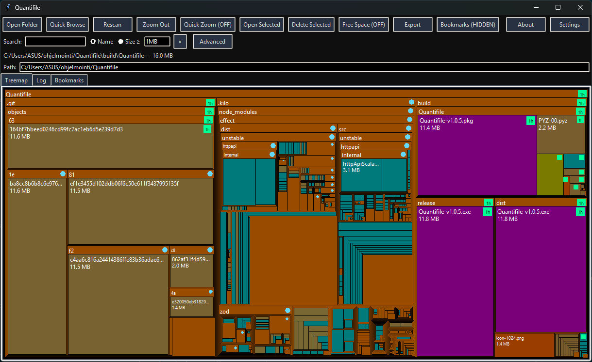

# Quantifile v1.0

A disk space visualization tool inspired by the classic SpaceMonger application. This tool provides an interactive treemap visualization of directory contents, making it easy to identify large files and folders at a glance.



## Features

- **Interactive Treemap Visualization**: Visualize directory contents as nested rectangles, where area represents file/folder size
- **Color-Coded Hierarchy**: Directories and files are color-coded by depth in the hierarchy, with customizable colors
- **Context Color Editing**: Right-click a folder or file to change its folder or file-type color
- **Navigation**:
  - Double-click folders to zoom in
  - Click "Zoom Out" button or press <kbd>Backspace</kbd> to navigate up
  - Arrow keys for spatial navigation through the treemap
  - Enter key to zoom into folders or open files
  - Right-click context menu with "Go Up" option
  - Quick zoom toggle for instant right-click zoom out
- **File Operations**:
  - Open files/folders with the system default application
  - Delete files/folders with confirmation
- **Free Space Visualization**: Toggle to show available drive space as a visual block
- **Export**: Export current treemap as SVG with proper fonts and positioning
- **Bookmarks**: Save favorite directories for instant access, with cached scan data for quick browsing
- **Settings Persistence**: Remembers window position, fullscreen state, colors, fonts, and scan behavior
- **Color Customization**: Customize colors for directories, files, selection, outlines, and labels with immediate application
- **Font Customization**: Configure UI font size, heading size, and treemap label font sizing
- **Animation Options**: Choose no animation, zoom animation, or collapse animation for treemap navigation
- **Log Tab**: Scan warnings, permission errors, and operation results are recorded without disruptive popups
- **Access-Denied Placeholders**: Inaccessible folders stay visible with a metadata-size or tiny placeholder block
- **Visual indicators for recently modified or accessed files**: Files modified in the last hour get a strong badge; recent files get a subtler marker
- **Dynamic UI**: Status text truncates based on window width, dialogs center properly
- **Rescan**: Re-scan directories to reflect changes
- **Cross-Platform**: Works on Windows, macOS, and Linux

## Installation

No installation required — the application uses only Python standard library modules:

- `os` — File system operations
- `sys` — System-specific parameters
- `math` — Mathematical operations
- `threading` — Background scanning
- `subprocess` — Opening files externally
- `tkinter` — GUI framework

### Requirements

- Python 3.6 or higher

## Usage

Run the application:

```bash
python main.py
```

### Controls

| Action | Method |
|--------|--------|
| **Select folder** | Click "Open Folder" button or press <kbd>Enter</kbd> with no selection |
| **Rescan current folder** | Click "Rescan" button |
| **Zoom out (go up one level)** | Click "Zoom Out" button, press <kbd>Backspace</kbd>, or right-click menu |
| **Navigate treemap** | Arrow keys for spatial movement |
| **Zoom/open selected** | Press <kbd>Enter</kbd> or double-click |
| **Quick zoom toggle** | Click "Quick Zoom" button |
| **Free space toggle** | Click "Free Space" button |
| **Open selected item** | Click "Open Selected" button |
| **Delete selected item** | Click "Delete Selected" button |
| **Export SVG** | Click "Export SVG" button |
| **Bookmarks** | Click "Bookmarks" button to open bookmarks tab |
| **View log messages** | Open the "Log" tab |
| **Settings** | Click "Settings" button |
| **About** | Click "About" button |
| **Select item** | Click on a rectangle |
| **Hover for info** | Move mouse over rectangles |
| **Right-click on item** | Opens context menu (Open file, Color, Properties*, Show in Explorer, Go Up, Add to Bookmarks) |

* Properties currently shows a placeholder dialog and can be expanded later with platform-specific support.

### How It Works

1. **Scanning**: When you select a folder, the application recursively scans all subdirectories and files, building a tree structure where each node tracks its size. Note: On Windows, drive roots may have permission restrictions; scan subdirectories like 'C:\Users' for better results.

2. **Treemap Layout**: The visualization uses a squarified-style treemap algorithm. The available rectangle is divided proportionally based on each item's size, while rows are chosen to reduce extreme aspect ratios.

3. **Rendering**: The treemap is drawn recursively on a Tkinter canvas. Each node is represented as a colored rectangle with a label (when space permits). Colors are customizable and vary by type and depth.

4. **Interactivity**:
   - Clicking selects a node and shows its path and size in the status bar
   - Double-clicking a directory zooms into it
   - Enter key zooms into folders or opens files
   - Arrow keys navigate spatially through adjacent items
   - Right-click selects the item and shows a context menu with open, color, properties, file manager, and zoom out options
   - Quick zoom toggle enables instant right-click zoom out
   - Free space toggle adds available drive space visualization
   - Scan warnings and operation results appear in the Log tab
   - Inaccessible folders are logged, counted in the scan summary, and shown as access-denied placeholders
   - Recently modified files are outlined/marked visually, with last-hour files emphasized
   - Backspace navigates to the parent directory
   - Hovering shows the cursor as a hand and displays path/size info

## Architecture

### Core Components

#### `main.py`
Small launcher that creates `Quantifile` and starts the Tkinter event loop.

#### `app.py`
Tkinter shell for top-level UI construction, logging, shared state, and mixin composition.

#### `models.py`
Shared data and formatting helpers:
- `Node` — file/directory tree node
- `human_size()` — formats byte counts like "1.5 MB"

#### `scanner.py`
Standalone recursive scanner helper used for simple non-GUI scans.

#### `layout.py`
Treemap layout algorithm for converting nodes into rectangles.

#### `scan_controller.py`
Background scan workflows, quick browse, shared worker pool, progress, access-denied placeholders, and scan completion.

#### `render_controller.py`
Treemap drawing, search highlighting, keyboard navigation, zoom animation, and mouse interactions.

#### `settings_controller.py`
Settings persistence, theme/font application, window geometry, and the tabbed Settings dialog.

#### `actions_controller.py`
Dialogs and user actions, including file operations, context menu, color settings, free-space display, SVG export, and About.

### Data Model

#### `Node` Class
Represents a file or directory in the tree:
- `path` — Full filesystem path
- `name` — Basename of the path
- `is_dir` — Boolean flag
- `size` — Size in bytes
- `children` — List of child nodes (for directories)

#### `Quantifile` Class (Main Application)
Tkinter-based GUI with:
- Toolbar with action buttons including toggles
- Search bar with name/size filtering
- Status bar with dynamic text truncation
- Tabbed treemap and log views
- Canvas for treemap rendering
- Settings persistence (window position, fullscreen, colors, fonts)
- Event handlers for mouse, keyboard, and context menu input

### Key Methods

- `choose_folder()` — Opens a folder selection dialog
- `start_scan(path)` — Spawns a background thread to scan the folder
- `finish_scan(node)` — Updates UI with scan results
- `draw()` — Renders the current node's treemap
- `draw_node()` — Recursively draws nodes and children
- `color_for_node()` — Computes color based on node type and depth
- `zoom_out()` — Navigates to the parent directory
- `open_selected()` — Opens the selected file/folder externally
- `delete_selected()` — Deletes the selected item with confirmation
- `on_arrow()` — Handles arrow key navigation
- `on_enter()` — Handles Enter key actions
- `on_right_click()` — Selects the item under the pointer and shows context menu
- `show_selected_color_dialog()` — Changes folder or file-type colors from the context menu
- `truncate_text()` — Truncates text to fit window width
- `export_svg()` — Exports treemap as SVG
- `show_settings()` — Tabbed appearance, font, behavior, and scan settings dialog
- `add_current_to_bookmarks()` — Adds the current directory to bookmarks
- `switch_to_bookmark(path)` — Switches treemap to show a bookmarked directory
- `log_message()` — Records non-blocking information, warnings, and errors in the Log tab

## Implementation Details

### Threading
Scanning is performed in a background thread to keep the UI responsive. The `after()` method is used to safely update the UI from the worker thread.

### Error Handling
- `PermissionError` during scanning creates a visible access-denied placeholder and writes to the Log tab
- Other `OSError` cases during scanning return empty/size-zero nodes and write to the Log tab
- File operations (open/delete) catch exceptions and write failures to the Log tab
- The UI gracefully handles zero-size or empty directories

### Performance Considerations
- Multi-threaded scanning uses one shared worker pool capped by the Maximum scan threads setting
- Nodes with `size == 0` are filtered out during treemap computation
- Minimum rectangle sizes (3×3 pixels) prevent excessive recursion
- Labels only render when there's sufficient space (>70×25 pixels)
- Directory padding adapts based on available space

## Limitations

- The treemap algorithm is a compact custom squarified-style implementation, not a full textbook squarify implementation
- No persistent history/bookmarks
- Progress bar shows item count but may not accurately reflect actual scan progress on some systems

## Future Enhancements

Potential improvements could include:
- Advanced search and filtering options
- Undo/redo for file operations
- Multi-selection and batch operations

## License

This project is licensed under the MIT License - see the [LICENSE](LICENSE) file for details.
